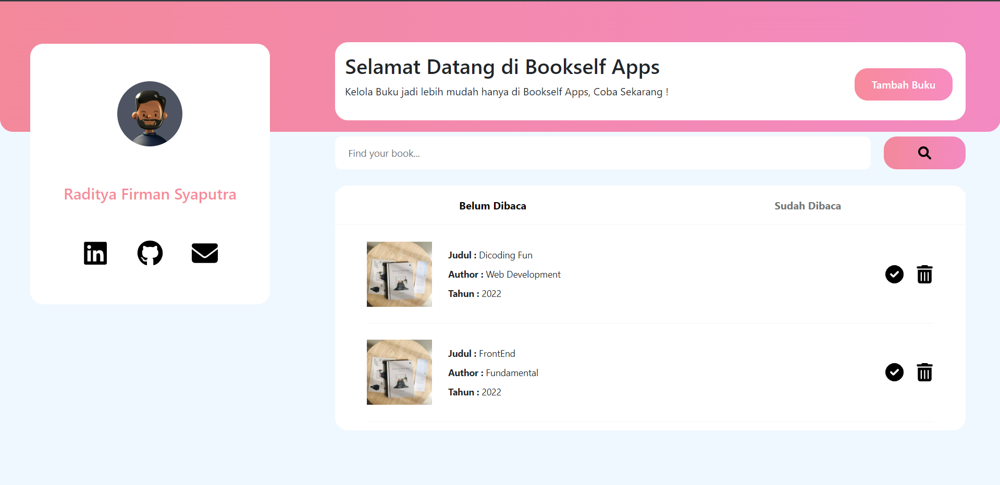

# PROJECT OVERVIEW

# Kriteria Bookshelf Apps

Buatlah aplikasi web yang dapat memasukan data buku ke dalam rak, memindahkan data buku antar rak, dan menghapus data buku dari rak.

Untuk lebih jelasnya, terdapat 5 kriteria utama pada Bookshelf Apps yang harus Anda buat.

## Kriteria 1: Mampu Menambahkan Data Buku ✅

1. Bookshelf Apps harus mampu menambahkan data buku baru.
2. Data buku yang disimpan merupakan objek JavaScript dengan struktur berikut:

## Kriteria 2: Memiliki Dua Rak Buku ✅

1. Bookshelf Apps harus memiliki 2 Rak buku. Yakni, “Belum selesai dibaca” dan “Selesai dibaca”.
2. Rak buku "Belum selesai dibaca" hanya menyimpan buku jika properti isComplete bernilai false.
3. Rak buku "Selesai dibaca" hanya menyimpan buku jika properti isComplete bernilai true.

## Kriteria 3: Dapat Memindahkan Buku antar Rak ✅

1. Buku yang ditampilkan pada rak, baik itu "Belum selesai dibaca" maupun "Selesai dibaca" harus dapat dipindahkan di antara keduanya.

## Kriteria 4: Dapat Menghapus Data Buku ✅

1. Buku yang ditampilkan pada rak, baik itu "Belum selesai dibaca" maupun "Selesai dibaca" harus dapat dihapus.

## Kriteria 5: Manfaatkan localStorage dalam Menyimpan Data Buku ✅

1. Data buku yang ditampilkan pada rak, baik itu "Belum selesai dibaca" maupun "Selesai dibaca" harus dapat bertahan walaupun halaman web ditutup.
2. Dengan begitu, Anda harus menyimpan data buku pada localStorage
